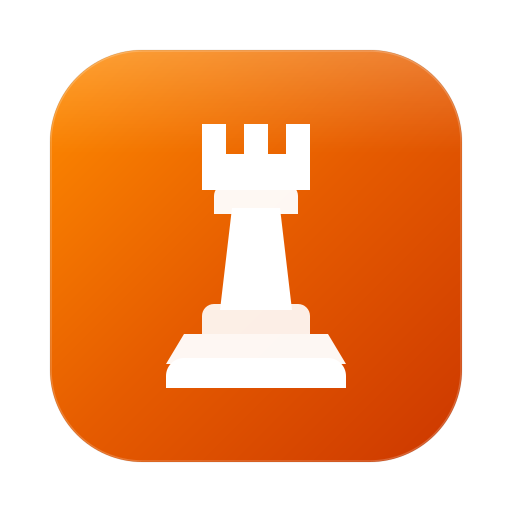
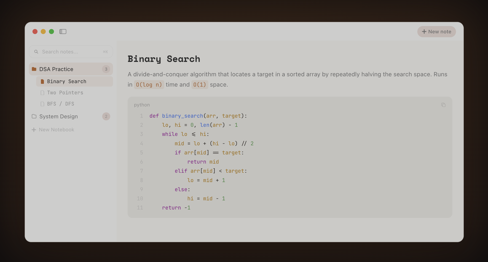
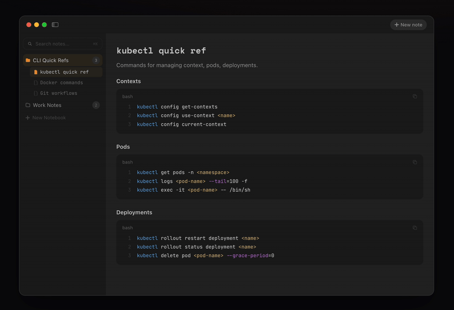

  

  <h1>Rook</h1>

  
<strong>The note-taking app for developers.</strong>

  
Rich text and code blocks, syntax highlighting, and various themes. Available for macOS.

  

    <a href="https://userook.app"><strong>Download for macOS</strong></a>
  

  

    
    
    
    
  

  
   

  

 

## Demo

## Features

- **Code blocks.** 17 languages with syntax highlighting.
- **Rich text and code.** Headings, lists, todos, code blocks.
- **5 themes.** Dark, Light, Terminal, Paper, Midnight.
- **Local and private.** No cloud, no account, your machine.

## Keyboard shortcuts

| Shortcut | Action |
|---|---|
| `⌘N` | New note |
| `⌘F` | Search |
| `⌘⇧↵` | Code block |
| `⌘,` | Settings |
| `⌥Click` | Multi-cursor |
| `⌘⇧⌫` | Delete note |

## Community notes

Drop-in Markdown cheatsheets for the CLIs and topics developers use every day. Browse [`community-notes/`](community-notes/) or open a PR to add one. See [CONTRIBUTING.md](CONTRIBUTING.md) for the format.

The Rook macOS app itself is a closed-source Swift project distributed as a signed binary via the [website](https://userook.app) and GitHub Releases.

## Status

Rook is available for macOS. [Download at userook.app](https://userook.app). Bug reports and feature requests welcome in [issues](../../issues), or say hi in [Discussions](../../discussions).

## License

Contents of this repository are released under the [MIT License](LICENSE). The compiled Rook macOS application is proprietary and distributed separately.
