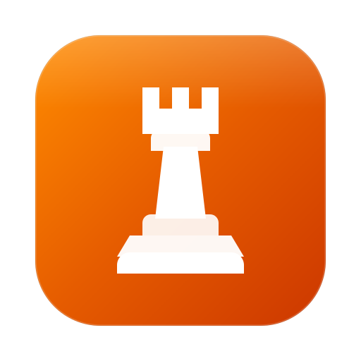
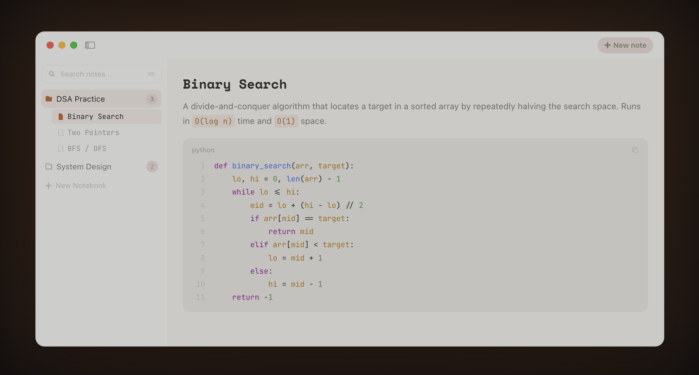
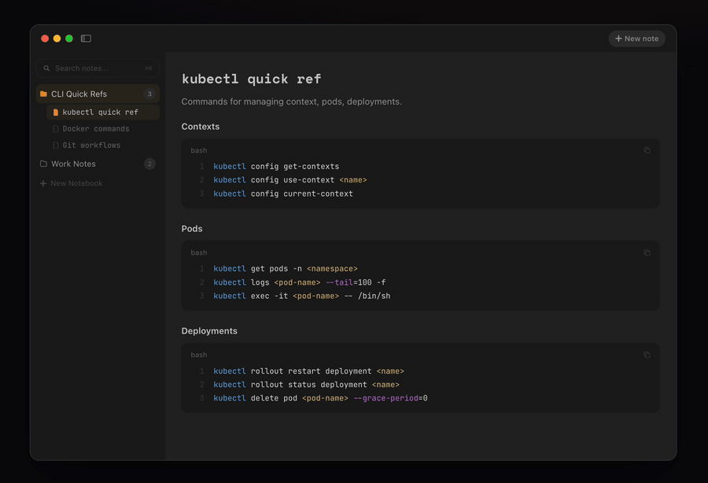

  

  <h1>Rook</h1>

  
<strong>Notes app, made for code.</strong>

  
For the code you write, paste, and keep around. Native Mac app.

  

    <a href="https://userook.app"><strong>Download for macOS</strong></a>
  

  

    
    
    
    
  

   

  

 

## Demo

## Features

- **Code blocks.** 17 languages with syntax highlighting.
- **Rich text and code.** Headings, lists, todos, code blocks.
- **5 themes.** Dark, Light, Terminal, Paper, Midnight.
- **Local and private.** No cloud, no account, your machine.

## Keyboard shortcuts

**Notes:** <kbd>⌘N</kbd> new · <kbd>⌘F</kbd> search · <kbd>Space</kbd> preview · <kbd>⌘⇧⌫</kbd> delete

**Editor:** <kbd>⌘⇧↵</kbd> code block · <kbd>⌘X</kbd> cut line · <kbd>⌘⌫</kbd> clear line · <kbd>⌥Click</kbd> multi-cursor

**Navigation:** <kbd>⌘↑</kbd> top · <kbd>⌘↓</kbd> bottom · <kbd>⌘&#92;</kbd> toggle sidebar

**View:** <kbd>⌘=</kbd> zoom in · <kbd>⌘-</kbd> zoom out

**App:** <kbd>⌘,</kbd> settings · <kbd>⌘/</kbd> shortcuts cheatsheet · <kbd>⌘Z</kbd> undo · <kbd>⌘⇧Z</kbd> redo

## Community notes

Drop-in Markdown cheatsheets for the CLIs and topics developers use every day. Browse [`community-notes/`](community-notes/) or open a PR to add one. See [CONTRIBUTING.md](CONTRIBUTING.md) for the format.

The Rook macOS app itself is a closed-source Swift project distributed as a signed binary via the [website](https://userook.app) and GitHub Releases.

## Bugs and feature requests

Found a bug or want a feature? [Open an issue](../../issues/new/choose) and pick a template.

## Discussions

Questions, ideas, or just say hi in [Discussions](../../discussions).

## Changelog

See [userook.app/changelog](https://userook.app/changelog).

## License

Contents of this repository are released under the [MIT License](LICENSE). The compiled Rook macOS application is proprietary and distributed separately.