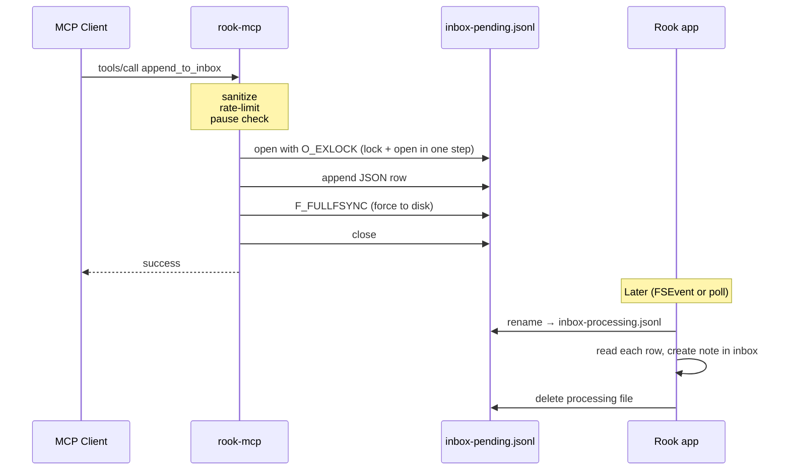

# Security Policy

## Trust Boundary

`rook-mcp` runs as a child process of an MCP client (Claude Desktop, Cursor, Claude Code, Codex, Gemini CLI, etc.). The client invokes `tools/call` with content the agent generated. The server treats that content as untrusted input: sanitize, bound, rate-limit, audit.

## Inbox Flow

`rook-mcp` writes new rows to the inbox file. Rook drains them into the user's inbox. The diagram below shows the full lifecycle of one `append_to_inbox` call.



## Input Sanitization

Every `append_to_inbox` call passes through `MCPSanitizer`:

- **Title**: strip control characters, trim whitespace, reject if empty, truncate to 200 characters.
- **Content**: strip null bytes, reject if empty, reject if longer than 100,000 characters.

Rook renders inbox content as plain text rather than HTML, JavaScript, and markdown.

## Rate Limit

Rolling 60-second window: at most 100 writes in any 60-second period, per `rook-mcp` process. Defends against a runaway agent calling `tools/call` in a loop.

Each spawned process counts independently. Two MCP clients running at the same time (Cursor and Claude Code, for example) each have their own count, by design.

## Pause Flag

Rook writes a file `mcp-paused.flag` into the app-group container when the user toggles pause in Settings → MCP. Each `append_to_inbox` call checks for the file before writing. If present, the call returns `-32003 paused` and writes an audit row with `status: paused_by_user`, so the rejected attempt is recorded but no content reaches Rook's inbox.

Only binaries signed with Rook's team ID can write to that container, so no other process can create this file.

## App Group as Trust Gate

The container path `AMKQ4HTK35.group.com.userook.rook` is reachable only by binaries signed under Apple Developer ID `AMKQ4HTK35` and entitled to that group. Random binaries on disk cannot write to Rook's inbox.

`rook-mcp` is bundled inside `Rook.app/Contents/Helpers/` so it inherits Rook's team ID and entitlement at signing time. An unsigned build from this repository returns `entitlement_unavailable` for every call.

## Atomic Inbox Append

When `AppendToInboxWriter.write` opens the inbox file, three measures protect the write:

- **Symlink redirection blocked.** The open refuses to follow symlinks (`O_NOFOLLOW`), so the inbox path can't be swapped for one that points elsewhere.
- **Mid-write rename blocked.** The lock and the open happen as a single step (`O_EXLOCK`). As two separate steps, Rook could rename the file from `inbox-pending.jsonl` to `inbox-processing.jsonl` between our open and our lock, leaving our write going to a file that's about to be deleted.
- **Data flushed before reporting success.** Every write is forced to disk (`fcntl(fd, F_FULLFSYNC)`) before the success response goes back, so a power loss between our write and Rook's next drain doesn't lose a row we already reported as saved.

## Parent Exit Cleanup

The server watches its parent process and exits when the parent exits:

```swift
DispatchSource.makeProcessSource(identifier: parentPid, eventMask: .exit, ...)
```

If the parent crashes without closing its end of stdin, the EOF we normally rely on never arrives, and `readLine` would block forever. Watching the parent's PID directly gives a backup exit signal that doesn't depend on the pipe.

## Sandbox

The bundled helper runs under the macOS app sandbox (`com.apple.security.app-sandbox = true`). Its only entitlement is `application-groups: AMKQ4HTK35.group.com.userook.rook`. Inside that container, it appends to `inbox-pending.jsonl` and reads the pause flag.

## Reporting a Vulnerability

Use GitHub's [private vulnerability reporting](https://docs.github.com/en/code-security/security-advisories/guidance-on-reporting-and-writing-information-about-vulnerabilities/privately-reporting-a-security-vulnerability) on this repository (Security tab → "Report a vulnerability"). Please do not file public issues for security findings.

If the report is reproducible and in scope (`MCPSanitizer`, `AppendToInboxWriter`, the JSON-RPC surface in `Server.swift` / `AppendToInboxHandler.swift`), a fix will be prepared in the private source repository and the OSS snapshot here will be updated as part of the next release.